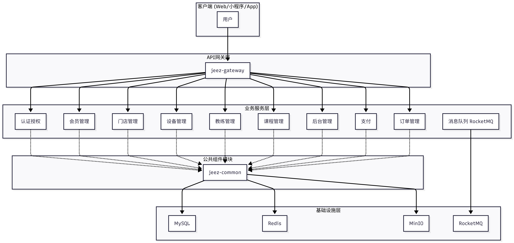
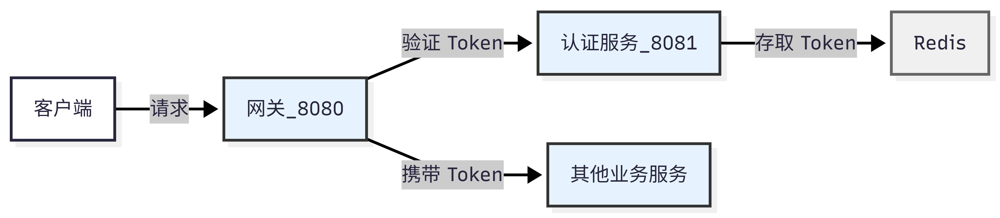

## UTF-8 Encoding Policy

To avoid garbled text (`乱码`) across Windows/macOS/Linux and IDEs, this project **must** use UTF-8 encoding consistently.

- All source/code/config/docs files must be UTF-8.
- Do not use GBK/GB2312/ANSI/UTF-16 for text files.
- IDE default project encoding should be UTF-8.
- Terminal and build tools should run with UTF-8 locale/encoding when possible.
- New files and modified files should be saved as UTF-8 without introducing mixed encodings.

Recommended settings:

- IntelliJ IDEA: `File -> Settings -> Editor -> File Encodings`
  - `Global Encoding`: `UTF-8`
  - `Project Encoding`: `UTF-8`
  - `Default encoding for properties files`: `UTF-8`
  - `Transparent native-to-ascii conversion`: disabled
- VS Code: `"files.encoding": "utf8"`
- Git (optional but recommended):
  - `git config --global i18n.commitEncoding utf-8`
  - `git config --global i18n.logOutputEncoding utf-8`

# Jeez.Fitness - 智能健身房管理系统

基于 Spring Boot 3.x + Spring Cloud 的微服务架构健身房管理系统

## 技术栈

| 类别 | 技术 | 版本 |
|------|------|------|
| 开发语言 | Java | 17 |
| 微服务框架 | Spring Boot | 3.1.5 |
| 微服务治理 | Spring Cloud | 2022.0.4 |
| API 网关 | Spring Cloud Gateway | - |
| 数据库 ORM | MyBatis-Plus | 3.5.9 |
| 数据库 | MySQL | 8.0.33 |
| 缓存 | Redis | 7+ |
| 认证授权 | Sa-Token | 1.37.0 |
| 消息队列 | RocketMQ | 5+ |
| 对象存储 | MinIO | - |
| API 文档 | SpringDoc OpenAPI | 2.3.0 |
| 支付 | 微信支付 SDK | 0.4.9 |

## 系统架构



## 模块说明

### 核心模块

| 模块 | 端口 | 说明 |
|------|------|------|
| jeez-gateway | 8080 | API 网关，统一入口，路由转发，API 文档聚合 |
| jeez-auth-fitness | 8081 | 认证中心，用户登录注册，Token 管理，权限控制 |
| jeez-common | - | 公共模块，统一响应类、工具类、常量定义 |

### 业务模块

| 模块 | 端口 | 说明 |
|------|------|------|
| jeez-member-fitness | 8082 | 会员管理：会员信息、会员卡、课程预约、健身记录 |
| jeez-store-fitness | 8083 | 门店管理：门店信息、营业时间、设施配置、公告管理 |
| jeez-equipment-fitness | 8084 | 设备管理：健身设备、维护记录、使用状态、WebSocket 通信 |
| jeez-coach-fitness | 8085 | 教练管理：教练信息、专业领域、排班管理、评价管理 |
| jeez-course-fitness | 8086 | 课程管理：课程信息、排期管理、预约管理、课程评价 |
| jeez-manager-fitness | 8087 | 管理后台：管理员账户、系统配置、数据统计、日志查看 |
| jeez-order-fitness | 8088 | **订单支付中心**：订单管理、微信支付、退款处理、支付回调 |

> **架构优化**: 原 `jeez-payment-fitness` 已合并到 `jeez-order-fitness`，实现订单和支付的统一管理，减少服务间调用，提升性能。

## 模块间联动

### 1. 认证流程



所有请求通过网关进入，网关将认证相关请求转发到 `jeez-auth-fitness`。认证成功后，Token 存储在 Redis 中，后续请求携带 Token 访问其他服务。

### 2. 会员业务流程

```
会员服务(8082)
    │
    ├──► Feign ──► 门店服务(8083)    查询门店信息
    │
    ├──► Feign ──► 课程服务(8086)    课程预约
    │
    └──► Feign ──► 教练服务(8085)    查询教练信息
```

会员模块通过 Feign 客户端调用其他服务，实现：
- 查询会员所属门店信息
- 会员预约课程
- 查询会员的私教教练

### 3. 订单支付流程（统一架构）

```
客户端
    │
    ▼
订单支付中心(8088) ─┬─► 创建订单
                   │
                   ├─► 调用微信支付 ──► 微信支付平台
                   │
                   ├─► 支付回调处理 ──► 更新订单状态
                   │
                   └─► RocketMQ ──► 会员服务(8082) 更新会员卡
```

**架构优势**：
- 订单和支付在同一服务内，减少网络调用，提升响应速度
- 事务一致性更容易保证
- 支付回调处理更加可靠

### 4. 课程预约流程

```
会员服务(8082)
    │
    ├──► 课程服务(8086)    查询可预约课程
    │
    ├──► 教练服务(8085)    查询教练排班
    │
    └──► 门店服务(8083)    查询门店营业时间
```

### 5. 服务间调用方式

| 调用方式 | 使用场景 | 示例 |
|----------|----------|------|
| Feign | 同步调用，需要立即返回结果 | 会员查询门店信息 |
| RocketMQ | 异步调用，不需要立即返回 | 订单创建通知 |
| 网关路由 | 客户端请求转发 | 所有外部请求 |

## 网关路由配置

```yaml
spring:
  cloud:
    gateway:
      routes:
        - id: auth-service
          uri: http://localhost:8081
          predicates:
            - Path=/auth/**
        - id: member-service
          uri: http://localhost:8082
          predicates:
            - Path=/member/**
        - id: store-service
          uri: http://localhost:8083
          predicates:
            - Path=/store/**
        - id: equipment-service
          uri: http://localhost:8084
          predicates:
            - Path=/equipment/**
        - id: coach-service
          uri: http://localhost:8085
          predicates:
            - Path=/coach/**
        - id: course-service
          uri: http://localhost:8086
          predicates:
            - Path=/course/**
        - id: manager-service
          uri: http://localhost:8087
          predicates:
            - Path=/manager/**
        - id: order-service
          uri: http://localhost:8088
          predicates:
            - Path=/order/**
```

## 认证授权

### Sa-Token 配置

所有服务共享相同的 Token 配置：

```yaml
sa-token:
  token-name: Authorization
  token-prefix: Bearer
  token-style: uuid
  timeout: 86400        # 24小时
  is-concurrent: true   # 允许多端登录
```

### 权限控制

```java
// 角色校验
@SaCheckRole("admin")
public Result<?> adminOnly() { }

// 权限校验
@SaCheckPermission("store:create")
public Result<?> createStore() { }
```

### 支持的登录方式

- 手机验证码登录
- 邮箱验证码登录
- 密码登录
- 微信小程序登录

## 项目结构

```
Jeez.Fitness/
├── jeez-gateway/           # API 网关 [8080]
├── jeez-auth-fitness/      # 认证中心 [8081]
├── jeez-member-fitness/    # 会员管理 [8082]
├── jeez-store-fitness/     # 门店管理 [8083]
├── jeez-equipment-fitness/ # 设备管理 [8084]
├── jeez-coach-fitness/     # 教练管理 [8085]
├── jeez-course-fitness/    # 课程管理 [8086]
├── jeez-manager-fitness/   # 管理后台 [8087]
├── jeez-order-fitness/     # 订单支付中心 [8088]（含支付功能）
├── jeez-common/            # 公共模块
├── docker/                 # Docker 部署配置和脚本
├── nginx/                  # Nginx 反向代理配置和部署脚本
├── ci-cd/                  # CI/CD 自动化部署脚本
├── docs/                   # 项目文档
└── pom.xml                 # Maven 父项目配置
```

### 模块代码结构

```
src/main/java/com/jeez/{module}/
├── controller/     # 控制器层
├── service/        # 业务逻辑层
│   └── impl/       # 实现类
├── mapper/         # 数据访问层
├── entity/         # 数据库实体
├── dto/            # 数据传输对象
│   ├── request/    # 请求对象
│   └── response/   # 响应对象
├── config/         # 配置类
└── feign/          # Feign 客户端
```

## 快速开始

### 环境要求

- Java 17+
- Maven 3.8+
- MySQL 8.0+
- Redis 7+
- RocketMQ 5+ (可选)
- MinIO (可选)

### Docker 部署（推荐）

适用于开发和生产环境的一键部署：

```bash
# Windows
cd docker
deploy.bat

# Linux / Mac
cd docker
chmod +x deploy.sh
./deploy.sh
```

Docker Compose 会自动启动以下服务：
- MySQL、Redis、RocketMQ、MinIO
- 全部 9 个微服务（Gateway、Auth、Member、Store、Equipment、Coach、Course、Manager、Order）

### 生产环境 Nginx 部署

配置 Nginx 反向代理，实现 HTTPS、负载均衡和静态资源服务：

```bash
# Linux / Mac
cd nginx
chmod +x deploy.sh
./deploy.sh ubuntu@your-server-ip

# Windows
cd nginx
deploy.bat ubuntu@your-server-ip

# 或使用 PowerShell
cd nginx
.\deploy.ps1 ubuntu@your-server-ip
```

部署后访问：
- **前端应用**: `https://your-domain.com/`
- **API 网关**: `https://your-domain.com/api/*`
- **MinIO 控制台**: `https://your-domain.com/minio/`
- **Swagger 文档**: `https://your-domain.com/swagger-gateway.html`

详细配置请参考 [nginx/README.md](nginx/README.md)

### 手动启动

1. 启动 MySQL 和 Redis

```bash
# Redis
redis-server --daemonize yes
```

2. 导入数据库脚本

```bash
mysql -u root -p < db/init.sql
```

3. 编译项目

```bash
mvn clean package -DskipTests
```

4. 按顺序启动服务

```bash
# 1. 启动网关
java -jar jeez-gateway/target/jeez-gateway.jar

# 2. 启动认证服务
java -jar jeez-auth-fitness/target/jeez-auth-fitness.jar

# 3. 启动业务服务
java -jar jeez-member-fitness/target/jeez-member-fitness.jar
java -jar jeez-store-fitness/target/jeez-store-fitness.jar
java -jar jeez-coach-fitness/target/jeez-coach-fitness.jar
java -jar jeez-course-fitness/target/jeez-course-fitness.jar
java -jar jeez-equipment-fitness/target/jeez-equipment-fitness.jar
java -jar jeez-manager-fitness/target/jeez-manager-fitness.jar
java -jar jeez-order-fitness/target/jeez-order-fitness.jar
```

### 访问地址

#### 本地开发环境

| 服务 | 地址 |
|------|------|
| API 网关 | http://localhost:8080 |
| 聚合 Swagger 文档 | http://localhost:8080/swagger-gateway.html |
| 认证服务文档 | http://localhost:8081/swagger-ui.html |
| 会员服务文档 | http://localhost:8082/swagger-ui.html |
| 订单支付服务文档 | http://localhost:8088/swagger-ui.html |

#### 生产环境（通过 Nginx）

| 服务 | 地址 |
|------|------|
| 前端应用 | https://your-domain.com |
| API 接口 | https://your-domain.com/api/* |
| MinIO 控制台 | https://your-domain.com/minio/ |
| 聚合 Swagger 文档 | https://your-domain.com/swagger-gateway.html |

## API 接口

### 认证接口

| 方法 | 路径 | 说明 |
|------|------|------|
| POST | /auth/sms/send | 发送短信验证码 |
| POST | /auth/sms/login | 短信验证码登录 |
| POST | /auth/email/send | 发送邮箱验证码 |
| POST | /auth/email/login | 邮箱验证码登录 |
| POST | /auth/password/login | 密码登录 |
| POST | /auth/wechat/login | 微信小程序登录 |
| GET | /auth/user/info | 获取当前用户信息 |
| POST | /auth/logout | 退出登录 |

### 业务接口

详细接口文档请访问各服务的 Swagger UI。

## 开发指南

### 添加新服务

1. 创建模块目录
2. 添加到父 pom.xml 的 modules
3. 配置 application.yml
4. 在网关添加路由配置

### 服务间调用

```java
// 定义 Feign 客户端
@FeignClient(name = "jeez-store-fitness", path = "/store")
public interface StoreFeignClient {
    @GetMapping("/{id}")
    Result<StoreResponse> getById(@PathVariable Long id);
}

// 使用
@Autowired
private StoreFeignClient storeFeignClient;

public void example() {
    Result<StoreResponse> result = storeFeignClient.getById(1L);
}
```

### 异步消息

```java
// 发送消息
@Autowired
private RocketMQTemplate rocketMQTemplate;

public void sendMessage() {
    rocketMQTemplate.convertAndSend("order:create", orderMessage);
}

// 接收消息
@RocketMQMessageListener(topic = "order:create", consumerGroup = "member-consumer")
public class OrderListener implements RocketMQListener<OrderMessage> {
    @Override
    public void onMessage(OrderMessage message) {
        // 处理消息
    }
}
```

## 部署架构

### 架构层次

```
┌─────────────────────────────────────────────────────────┐
│                    客户端 / 浏览器                         │
└─────────────────────────────────────────────────────────┘
                            │
                            ▼
┌─────────────────────────────────────────────────────────┐
│                  Nginx (HTTPS/反向代理)                   │
│  - SSL/TLS 加密                                          │
│  - 静态资源服务                                            │
│  - API 路由转发 (/api/*)                                  │
│  - MinIO 路由转发 (/minio/*)                              │
└─────────────────────────────────────────────────────────┘
                            │
                            ▼
┌─────────────────────────────────────────────────────────┐
│              Spring Cloud Gateway (8080)                 │
│  - 统一入口                                               │
│  - 路由转发                                               │
│  - API 文档聚合                                           │
└─────────────────────────────────────────────────────────┘
                            │
          ┌─────────────────┼─────────────────┐
          ▼                 ▼                 ▼
    ┌──────────┐      ┌──────────┐      ┌──────────┐
    │  Auth    │      │  Member  │ ...  │  Order   │
    │  (8081)  │      │  (8082)  │      │  (8088)  │
    │          │      │          │      │ 订单+支付 │
    └──────────┘      └──────────┘      └──────────┘
          │                 │                 │
          └─────────────────┼─────────────────┘
                            ▼
              ┌──────────────────────────┐
              │   基础设施服务              │
              │  - MySQL (3306)          │
              │  - Redis (6379)          │
              │  - RocketMQ (9876)       │
              │  - MinIO (9000/9001)     │
              └──────────────────────────┘
```

### 部署方式选择

| 部署方式 | 适用场景 | 特点 |
|---------|---------|------|
| **Docker Compose** | 开发/测试环境 | 一键启动所有服务，快速搭建 |
| **手动启动** | 本地开发调试 | 灵活控制单个服务启停 |
| **Nginx + Docker** | 生产环境 | HTTPS、负载均衡、高可用 |
| **CI/CD 自动化** | 持续部署 | 自动构建、测试、部署 |

## 开发工具配置

### Claude Code

本项目支持 Claude Code 进行 AI 辅助开发。

**配置文件：**
- `.claude/settings.json` - 共享配置（已纳入版本控制）
- `.claude/settings.local.json` - 本地配置（已忽略，不纳入版本控制）

**本地配置示例：**

```bash
# 创建本地配置文件
cp .claude/settings.json .claude/settings.local.json
# 根据需要修改本地配置
```

本地配置文件用于存放个人偏好设置，不会影响其他开发者。

## 常见问题

**Q: 端口冲突怎么办？**

修改对应服务的 `application.yml` 中的 `server.port` 配置。

**Q: Token 认证失败？**

1. 检查请求头格式：`Authorization: Bearer {token}`
2. 检查 Token 是否过期
3. 检查 Redis 连接是否正常

**Q: 服务间调用失败？**

1. 检查目标服务是否启动
2. 检查 Feign 客户端配置
3. 检查网络连通性
